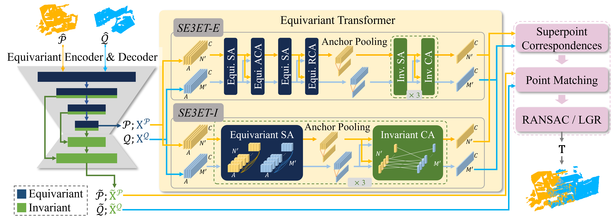

# SE3ET: SE(3)-Equivariant Transformer for Low-Overlap Point Cloud Registration

[Paper Link](http://arxiv.org/abs/2407.16823)

This work proposes exploiting equivariant learning from 3D point clouds to improve registration robustness. We propose SE3ET, an SE(3)-equivariant registration framework that employs equivariant point convolution and equivariant transformer design to learn expressive and robust geometric features.

```
@article{lin2024se3et,
  title={SE3ET: SE(3)-Equivariant Transformer for Low-Overlap Point Cloud Registration},
  author={Lin, Chien Erh and Zhu, Minghan and Ghaffari, Maani},
  journal={IEEE Robotics and Automation Letters},
  year={2024},
  publisher={IEEE}
}
```



## Installation

Please use the following command for installation.

Build docker environment or conda environment
- docker
```
cd docker
docker build --tag umcurly/geotransformer .
bash build_docker_container.bash [container_name]
```
- conda
```
conda create -n se3et python==3.8
conda activate se3et
pip install torch==1.7.1+cu110 -f https://download.pytorch.org/whl/torch_stable.html
pip install -r requirements.txt

```
Build extension package (might need root access)
```
python setup.py build develop
```
Build extension package for E2PN (might need root access)
```
cd geotransformer/modules/e2pn/vgtk
python setup.py build_ext -i
```

Code has been tested with Ubuntu 20.04, GCC 9.3.0, Python 3.8, PyTorch 1.7.1, CUDA 11.1 and cuDNN 8.1.0.

## Pre-trained Weights
Please download the weights on [Google Drive](https://drive.google.com/drive/folders/1mnjdBZptRtnZMReSxkM2GBpKz2FPVA6v?usp=sharing) and put them in `weights` directory.

## Which model to use? SE3ET-E vs. SE3ET-I
TL;DR: We suggest you to use SE3ET-E if the input point cloud is small (<10k points) and use SE3ET-I if the input point cloud is large (>10k points). 

In the paper, we propose two transformer configurations. **SE3ET-E** contains all the equivariant and invariant self-attention and cross-attention we proposed, and **SE3ET-I** contains equivariant self-attention and invariant cross-attention. The first one provides better performance on low-overlap and random rotation cases but higher on memory consumption. The latter one maintain good performance while keeping lower memory consumption. We suggest you use SE3ET-E if the input point cloud is small (<10k points) and use SE3ET-I if the input point cloud is large (>10k points). We also provide SE3ET-E2 and SE3ET-I2 which the feature size is 2x smaller to boost computation performance. Please check the paper for their performance comparison.

## Demo
If you just want to test how well it works, run the demo code.
TODO

## 3DMatch

### Data Preparation

The dataset can be downloaded from [PREDATOR](https://github.com/prs-eth/OverlapPredator). Check out [PREDATOR](https://github.com/prs-eth/OverlapPredator) and [GeoTransformer](https://github.com/qinzheng93/GeoTransformer) repositories for preparing data.

### Training

The code for 3DMatch is in `experiments/se3ete.3dmatch` for SE3ET-E and `experiments/se3eti.3dmatch` for SE3ET-I. Inside the folder, change `config.py` accordingly. Then, use the following command for training.

```
CUDA_VISIBLE_DEVICES=0 python trainval.py
```

### Testing
Command to generate features from point clouds
```
CUDA_VISIBLE_DEVICES=0 python test.py --snapshot=../../weights/se3ete.3dmatch.pth.tar --benchmark=3DMatch
CUDA_VISIBLE_DEVICES=0 python test.py --snapshot=../../weights/se3ete.3dmatch.pth.tar --benchmark=3DLoMatch
```

Command to run feature matching and registration
```
CUDA_VISIBLE_DEVICES=0 python eval.py --num_corr=5000 --benchmark=3DMatch --method=ransac
```
or 
```
CUDA_VISIBLE_DEVICES=0 python eval.py --benchmark=3DMatch --method=lgr
```

### Testing with Random Rotation
Direct to folders `experiments/se3ete.3dmatch.evalrot` for SE3ET-E or  `experiments/se3eti.3dmatch.evalrot` for SE3ET-I and follow the testing commands using the same pretrained weight. In these folders, we changed the following code to test the algorithm with random rotation of the input.
1. In `dataset.py`, `rotated=True,` is added in the configuration of `test_dataset = ThreeDMatchPairDataset()` function.
2. In `eval.py`, `transform = gt_logs[gt_index]['transform']` is commentted out. We are loading the transformation from data_dict constructed in dataloader.

## KITTI Point Cloud Pairs

### Data preparation

Download the data from the [Kitti official website](http://www.cvlibs.net/datasets/kitti/eval_odometry.php) into `data/Kitti` and run `data/Kitti/downsample_pcd.py` to generate the data. 

### Training

The code for Kitti is in `experiments/se3eti.kitti`. Use the following command for training.

```bash
CUDA_VISIBLE_DEVICES=0 python trainval.py
```

### Testing

Use the following command for testing.

```bash
CUDA_VISIBLE_DEVICES=0 python test.py --snapshot=../../weights/se3eti.kitti.pth.tar
CUDA_VISIBLE_DEVICES=0 python eval.py --method=lgr
```

### Testing with Random Rotation
Direct to folder `experiments/se3eti.kitti.evalrot` and follow the testing commands using the same pretrained weight. In `dataset.py`, the following configuration is added to the `test_dataset = OdometryKittiPairDataset()` function to test the algorithm with random rotation of the input.
```
use_augmentation=cfg.train.use_augmentation,
augmentation_noise=cfg.train.augmentation_noise,
augmentation_min_scale=cfg.train.augmentation_min_scale,
augmentation_max_scale=cfg.train.augmentation_max_scale,
augmentation_shift=cfg.train.augmentation_shift,
augmentation_rotation=cfg.train.augmentation_rotation,
```


## Generalization Test
In the generalization test, we evaluate the SE3ET-I2 model that trained on 3DMatch on (scaled) KITTI point cloud pairs. 
Direct to `experiment/se3eti2.3dmatch.evalkitti`, and run 
```bash
CUDA_VISIBLE_DEVICES=0 python test.py --snapshot=../../weights/se3eti.kitti.pth.tar
CUDA_VISIBLE_DEVICES=0 python eval.py --method=lgr
```

## Acknowledgements
- [GeoTransformer](https://github.com/qinzheng93/GeoTransformer)
- [E2PN](https://github.com/minghanz/E2PN)

We thank the authors for open sourcing their methods, the code is heavily borrowed from [GeoTransformer](https://github.com/qinzheng93/GeoTransformer) and [E2PN](https://github.com/minghanz/E2PN).